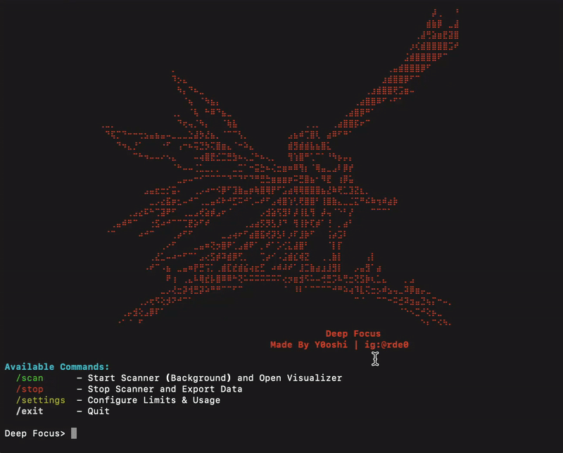

# Deep Focus

A high-performance network reconnaissance tool for discovering and fingerprinting services across IP ranges. Built for security researchers and network administrators.



---

## Table of Contents

1. [Overview](#overview)
2. [Features](#features)
3. [Requirements](#requirements)
4. [Installation](#installation)
5. [Usage](#usage)
6. [Configuration](#configuration)
7. [Understanding Export Logs](#understanding-export-logs)
8. [Target Selection Guide](#target-selection-guide)
9. [Troubleshooting](#troubleshooting)
10. [License](#license)

---

## Overview

Deep Focus is an asynchronous network scanner designed for large-scale service discovery. It performs intelligent probing of common network services and provides detailed authentication status information for each discovered service. You can consider it your personal **mini Shodan**.

The tool is optimized for passive cooling systems (such as Apple M-series laptops) with built-in thermal management that automatically throttles scanning when system load is high.

### Key Capabilities

- Scans IP ranges for open services (HTTP, FTP, SSH, VNC, RTSP, RDP)
- Identifies authentication requirements for discovered services
- Fingerprints service types and vendors
- Exports actionable intelligence in structured format
- Manages system resources to prevent overheating

---

## Features

### Service Probes

| Service | Port | Detection Capabilities |
|---------|------|------------------------|
| HTTP/HTTPS | 80, 443, 8080, 8443 | Server type, response codes, page titles |
| FTP | 21 | Anonymous access detection |
| SSH | 22 | Server version, device type identification |
| VNC | 5900 | Authentication type (None, Password, TLS) |
| RTSP | 554 | Camera brand, authentication status |
| RDP | 3389 | Service availability |

### Authentication Detection

The tool specifically identifies services that may be accessible without credentials:

- **VNC**: Detects "None" authentication type (passwordless access)
- **FTP**: Tests anonymous login capability
- **RTSP**: Identifies cameras without authentication requirements

### Thermal Management

Built-in governor monitors system load and automatically pauses scanning when thresholds are exceeded, preventing thermal throttling on passively-cooled systems.

---

## Requirements

- Python 3.8 or higher
- macOS, Linux, or Windows
- Network access to target ranges

---

## Installation

### Quick Start (Recommended)

Deep Focus comes with automated installers for all major platforms.

1. **Download and Enter Directory**:
   ```bash
   git clone https://github.com/Y0oshi/Project-Deep-Focus.git
   cd deep-focus
   ```

2. **Run Installer**:
   - **macOS / Linux**: `./install.sh`
   - **Windows**: `.\install.bat`

3. **Launch**:
   Restart your terminal, then type:
   ```bash
   deepfocus
   ```

That's it! You can now run the tool from anywhere.

---

### Manual Installation (Optional)

If you prefer to configure everything yourself:

1. ensure python 3.8+ is installed.
2. create a virtual environment: `python3 -m venv venv`
3. activate it: `source venv/bin/activate`
4. install packages: `pip install rich aiosqlite`
5. run: `python3 deep_focus.py`

---

## Usage

### Starting the Tool

```bash
python deep_focus.py
```

### Available Commands

| Command | Description |
|---------|-------------|
| `/scan` | Start scanning and open the live dashboard |
| `/stop` | Stop scanning and export results |
| `/settings` | Configure scan parameters |
| `/exit` | Exit the application |

### Basic Workflow

1. Launch the tool with `python deep_focus.py`
2. Configure target network with `/settings` (Option 1)
3. Adjust scan speed if needed with `/settings` (Option 3)
4. Start scanning with `/scan`
5. Monitor progress in the live dashboard
6. Press Ctrl+C to detach from dashboard (scanning continues)
7. Use `/stop` to halt scanning and export results

---

## Configuration

Access configuration menu with `/settings`:

### Option 1: Target Network

Specify the IP range to scan in CIDR notation.

```
Example: 192.168.1.0/24 (256 IPs)
Example: 10.0.0.0/16 (65,536 IPs)
```

### Option 2: Power Level (10-100%)

Controls thermal limits. Higher values allow more aggressive scanning but increase heat generation.

| Power Level | Max System Load | Recommended For |
|-------------|-----------------|-----------------|
| 10-30% | Low | Laptops on battery |
| 40-60% | Medium | Normal operation |
| 70-100% | High | Desktop systems with active cooling |

### Option 3: Scan Speed (100-1000 threads)

Controls concurrent connection attempts.

| Speed | Threads | Notes |
|-------|---------|-------|
| 100-300 | Conservative | Recommended for home routers |
| 300-600 | Optimal | Best balance of speed and stability |
| 600-1000 | Aggressive | May cause router overload or heat issues |

**Warning**: Speeds above 600 threads may cause router instability or system overheating.

### Option 4: Export Path

Directory where scan results will be saved.

---

## Understanding Export Logs

Export files are saved as text files with the naming convention:
```
deep_focus_export_[timestamp].txt
```

### Log Entry Format

Each discovered service is recorded with the following structure:

```
IP: 192.168.1.100
Port: 21
Service: ftp
banner: 220 FTP Server Ready | Auth: [Anonymous Access ALLOWED]
--------------------
```

### Field Descriptions

| Field | Description |
|-------|-------------|
| IP | Target IP address |
| Port | Service port number |
| Service | Identified service type |
| banner | Service response and authentication status |

### Authentication Status Indicators

#### FTP (Port 21)
| Status | Meaning |
|--------|---------|
| `Anonymous Access ALLOWED` | Server accepts anonymous login |
| `Anonymous User Rejected` | Anonymous login disabled |
| `Encryption Required (AUTH TLS)` | TLS required before authentication |

#### VNC (Port 5900)
| Status | Meaning |
|--------|---------|
| `None (OPEN)` | No password required |
| `VNC Auth` | Password authentication required |
| `VeNCrypt (TLS)` | TLS encryption required |

#### RTSP (Port 554)
| Status | Meaning |
|--------|---------|
| `No Auth Required (OPEN)` | Stream accessible without credentials |
| `Auth Required` | Credentials needed |
| `Forbidden` | Access denied |

Camera brands are identified when possible: Hikvision, Dahua, Axis, Foscam, Amcrest, Reolink, Ubiquiti.

#### SSH (Port 22)
| Type | Meaning |
|------|---------|
| `OpenSSH X.X` | Standard OpenSSH server |
| `Dropbear (Embedded/IoT)` | Lightweight SSH, often on IoT devices |
| `MikroTik Router` | MikroTik network equipment |
| `Cisco IOS` | Cisco network device |

---

## Target Selection Guide

The included `targets.json` file contains a curated list of high-value IP ranges organized by provider and region. You can open this file to find tested IP ranges for various discovery goals.

Each entry in `targets.json` includes:
- Provider name
- Description of typical findings
- IP ranges in CIDR notation

### Range Categories

| Category | Typical Findings |
|----------|------------------|
| Cloud Providers (Hetzner, OVH, Vultr) | Web servers, dashboards, FTP, VNC |
| Budget Hosting (Contabo) | Forgotten servers, misconfigured services |
| Residential ISPs (Korea, Taiwan, China) | IoT devices, cameras, NAS drives |

### Recommended Targets by Goal

| Goal | Recommended Providers |
|------|----------------------|
| FTP/SSH Discovery | Contabo, Hetzner, OVH |
| Camera Discovery | Korea Telecom, Taiwan HiNet, China Telecom |
| VNC Access | Vultr, DigitalOcean, Contabo |

---

## Troubleshooting

### Scanner stops responding

The thermal governor may have paused scanning. Check system load and wait, or reduce power level in settings.

### Low discovery rate

- Verify target range has active hosts
- Check network connectivity
- Some ranges may be heavily firewalled

### Router becomes unstable

Reduce scan speed to 300-400 threads. High thread counts can overwhelm consumer routers.

### Permission errors on export

Verify the export path exists and is writable.

---

## License

This tool is provided for authorized security testing and network administration only. Users are responsible for ensuring compliance with applicable laws and regulations.

---

## Author

Made by Y0oshi | Instagram: @rde0
